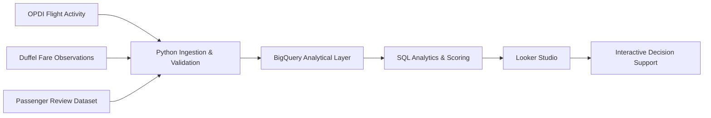

# AeroPulse — Aviation Route Opportunity Intelligence

> Turning complex aviation information into smarter route, airline and flight decisions.

## Overview

AeroPulse is an aviation analytics and decision-support project that combines route performance, airline activity, observed timing, fare observations and passenger-experience evidence to help answer a practical question:

**Which flight option makes the most sense — and why?**

Instead of relying on a single signal such as price, AeroPulse combines multiple evidence layers and presents them through an interactive Looker Studio dashboard.

The project is designed as an analytical prototype and decision-support system rather than a booking engine or predictive model.

---

## The Decision Challenge

Choosing a flight is rarely only about price.

Travelers may also consider:

- Which airline is strongest on the route?
- When is flight activity most concentrated?
- How does the observed fare compare with alternatives?
- What do passengers report about the airline experience?
- Does the recommendation change for different traveler profiles?

AeroPulse brings these perspectives together into one decision-support environment.

---

## What AeroPulse Does

AeroPulse provides eight analytical dashboard pages:

1. **Welcome to AeroPulse**
2. **Executive Route Intelligence**
3. **Flight Choice Advisor**
4. **Route & Airline Deep Dive**
5. **Flight Timing Intelligence**
6. **Price & Market Intelligence**
7. **Passenger Experience Intelligence**
8. **AeroPulse FAQ & Methodology**

The central **Flight Choice Advisor** allows users to select:

- Origin airport
- Destination airport
- Month
- Preferred time window
- Traveler type: Business or Leisure

It then ranks the top three airline options for the selected scenario and explains the recommendation.

### Core message

**AeroPulse doesn't just tell you which option to choose — it explains why.**

---

## Project Scope

The Flight Choice Advisor currently covers:

| Scope | Coverage |
|---|---:|
| Major German origin airports | 5 |
| Destination airports | 85 |
| Meaningful routes | 239 |
| Mapped airlines | 28 |
| Eligible flight records | 560K+ |
| OPDI observation period | Aug 2025 – Jul 2026 |

Origin airports:

- BER — Berlin
- FRA — Frankfurt
- DUS — Düsseldorf
- HAM — Hamburg
- MUC — Munich

---

## How AeroPulse Works

The analytical workflow can be summarized as:

**OBSERVE → ANALYZE → COMPARE → RECOMMEND**

### 1. Observe

Collect aviation observations and supporting reference data.

### 2. Analyze

Calculate route, airline, activity, growth, performance and seasonality indicators.

### 3. Compare

Compare airline and route alternatives within the selected scenario.

### 4. Recommend

Apply transparent decision rules to produce explainable recommendations.

The recommendation layer is **rule-based rather than a predictive AI model**.

---

## AeroPulse Score

The broader AeroPulse performance framework uses analytical components including:

- Demand
- Growth
- Performance
- Route strength
- Seasonality

These contribute to the broader **AeroPulse Score** and route opportunity assessment.

Additional evidence layers such as price and passenger experience are intentionally kept separate from the core AeroPulse Performance/Opportunity Score.

This separation distinguishes:

**core route and airline performance evidence**

from

**supporting decision evidence.**

The **Flight Choice Advisor** uses its own production scoring pipeline based on:

- monthly service/activity strength
- service consistency
- route-airline strength
- observed time-period fit
- price evidence where sufficiently reliable

The Advisor methodology is documented separately in:

`docs/advisor_pipeline.md`

---

## Evidence Layers

### Flight Timing Intelligence

Analyzes observed flight activity across detailed three-hour time windows:

| Time window | Label |
|---|---|
| 00:00–03:00 | Late Night |
| 03:00–06:00 | Early Morning |
| 06:00–09:00 | Morning |
| 09:00–12:00 | Late Morning |
| 12:00–15:00 | Midday |
| 15:00–18:00 | Afternoon |
| 18:00–21:00 | Evening |
| 21:00–00:00 | Night |

Important: these represent **observed activity periods derived from OPDI/ADS-B observations**, not scheduled departure times.

### Price & Market Intelligence

The price layer uses fare observations collected through Duffel test-mode data for selected routes and departure dates.

It provides:

- observed fare levels
- fare ranges
- route-relative price bands
- airline price positioning
- price evidence coverage
- sample-quality indicators

Price observations are **not presented as live market prices**.

The current production price dataset covers a limited set of routes and a departure date of **15 October 2026**.

### Passenger Experience Intelligence

Passenger experience analysis uses the **Airline Travel Reviews Data (Skytrax)** dataset.

The analysis covers:

- overall passenger rating
- seat comfort
- cabin staff service
- food & beverages
- inflight entertainment
- ground service
- Wi-Fi & connectivity
- value for money

Only airlines with verified name matches to the AeroPulse airline reference are included.

Passenger experience is presented as a separate evidence layer and is **not included in the core AeroPulse Performance/Opportunity Score**.

Passenger review ratings represent reported customer perceptions in the source dataset; they are not operational performance measurements.

---

## Data Sources

### OpenSky / OPDI

The aviation activity layer is based on the **OpenSky Network Open Data for Performance and Infrastructure (OPDI)**.

The project uses observed flight activity from August 2025 through July 2026 for the main Flight Choice Advisor scope.

OPDI/ADS-B observations provide observed aircraft activity but do not directly provide commercial scheduled departure times in the basic dataset.

### Duffel

Duffel was used to collect test-mode fare observations for selected routes.

These observations are treated as fare snapshots rather than live market prices.

### Airline Travel Reviews Data (Skytrax)

Passenger-experience analysis uses:

**Airline Travel Reviews Data (Skytrax), 2015–2025**

Mendeley Data:

https://data.mendeley.com/datasets/vgjk58vf8h/1

DOI:

`10.17632/vgjk58vf8h.1`

The dataset contains passenger reviews and ratings across multiple airline-experience dimensions.

---

## Technology Stack

| Technology | Role |
|---|---|
| Python | Data processing, transformation and validation |
| SQL | Analytical modelling and recommendation logic |
| BigQuery | Data warehouse and analytical layer |
| Looker Studio | Interactive dashboard and visualization |
| Git / GitHub | Version control and portfolio documentation |

---

## How to Reproduce

The repository contains the Python processing scripts and SQL transformation layers used to build the AeroPulse analytical workflow.

### 1. Set up the Python environment

```bash
conda create -n aeropulse python=3.12
conda activate aeropulse
pip install -r requirements.txt
```

### 2. Configure environment variables

Copy `.env.example` to `.env` and configure the required project and BigQuery settings. Credentials and secrets should remain local and must not be committed to GitHub.

### 3. Run the data pipeline

The main processing workflow is:

```text
OPDI monthly data
        ↓
download_opdi_history.py
        ↓
transform_opdi_flights.py
        ↓
validate_opdi_flights.py
        ↓
enrich_opdi_airports.py
        ↓
validate_enriched_flights.py
        ↓
load_staging.py
        ↓
BigQuery
```

Additional Python scripts support source inspection, operator auditing, airport/reference downloads, data-quality checks and API testing.

### 4. Build the analytical SQL layers

The `sql/` directory contains the BigQuery DDL and analytical views used by AeroPulse. The Flight Choice Advisor pipeline is documented in [`docs/advisor_pipeline.md`](docs/advisor_pipeline.md).

### 5. Connect the dashboard

The final BigQuery dashboard view can be connected to Looker Studio to reproduce the interactive Flight Choice Advisor experience.

> **Reproducibility note:** The public repository documents the processing and analytical workflow, but source datasets, API credentials and the user's BigQuery environment are not included in the repository.

---

## Data Pipeline

The project follows a structured analytical pipeline:

```text
External Aviation Data
        ↓
Data Collection
        ↓
Python Transformation & Validation
        ↓
BigQuery
        ↓
Analytical Views & Recommendation Logic
        ↓
Looker Studio
        ↓
Interactive Decision Support
```

The Flight Choice Advisor production logic is documented in:

`docs/advisor_pipeline.md`

The Advisor data model is documented in:

`docs/advisor_data_model.md`

---

## Data Lineage

AeroPulse follows a structured path from external aviation data to interactive decision support:




---

## Flight Choice Advisor — Production Logic

The production Advisor follows this analytical flow:

```text
Historical OPDI observations
            ↓
Advisor activity fact
(route × month × ICAO operator)
            ↓
Airline mapping
            ↓
Route + month enrichment
            ↓
Activity strength
            +
Service consistency
            +
Observed time-period fit
            +
Route-airline strength
            +
Price evidence
            ↓
Final Advisor Score
            ↓
Recommendation Level
            ↓
Dashboard Recommendation
```

The production Advisor score uses:

| Component | Weight |
|---|---:|
| Monthly service score | 35% |
| Observed time-period fit | 25% |
| Route-airline strength | 25% |
| Price evidence | 15% |

When reliable price evidence is unavailable, the non-price components are normalized so that missing price data does not penalize the recommendation.

### Worked Production Example

The following example uses a real production scenario from the Flight Choice Advisor:

| Input | Example |
|---|---|
| Route | BER → BRU |
| Month | August |
| Preferred time | Morning |
| Airline | Brussels Airlines |

For this route-month-airline combination, the production data contains **61 observed flights**, classified as **Very Strong** activity. The airline is active in all 12 months of the analysis period, resulting in a **Year-Round** consistency classification. The resulting Monthly Service Score is **100.0**.

The selected Morning time period has a **100** time-fit score, and the route-airline strength score is also **100.0**.

No reliable fare observation is available for this scenario. Following the production methodology, the non-price components are normalized rather than penalized because price evidence is missing.

The resulting Advisor output is:

**Advisor Score: 100.0 — Excellent Choice**

The recommendation reason states that the option is recommended based on service activity, preferred-time fit and route-airline performance, with no price observation available.

> This is an example of how the AeroPulse scoring framework operates for one specific scenario. It is not a universal ranking of airlines.


Recommendation categories are:

| Advisor score | Recommendation |
|---:|---|
| ≥80 | Excellent Choice |
| ≥70 | Strong Choice |
| ≥60 | Good Choice |
| ≥50 | Consider |
| <50 | Lower Priority |

---

## Data Quality & Interpretation

AeroPulse is designed around transparent evidence and explicit limitations.

The project distinguishes between:

- observed flight activity and passenger demand
- observed activity periods and scheduled departure times
- fare observations and live market prices
- passenger review perceptions and operational performance
- analytical recommendations and predictive forecasts

The recommendation engine does not claim to predict:

- passenger demand
- future airline performance
- ticket prices
- delays or cancellations
- profitability
- customer satisfaction

OPDI-based activity is an **observed aviation activity signal**, not a direct measure of commercial demand or airline financial performance.

---

## Repository Structure

```text
AeroPulse/
│
├── data/
│   ├── raw/
│   ├── processed/
│   └── ...
│
├── docs/
│   ├── advisor_data_model.md
│   ├── advisor_pipeline.md
│   ├── analytical_variables.md
│   ├── business_questions.md
│   ├── dashboard_requirements.md
│   ├── data_freshness.md
│   ├── data_model.md
│   ├── data_requirements_checklist.md
│   ├── data_scope.md
│   ├── data_sources.md
│   ├── kpi_definitions.md
│   ├── recommendation_methodology.md
│   └── source_evaluation.md
│
├── python/
│   └── ...
│
├── sql/
│   └── ...
│
├── .env.example
├── .gitignore
└── README.md
```

Raw and sensitive data are not intended to be committed to the public repository.

---

## Portfolio Links

### Interactive Dashboard

**AeroPulse — Looker Studio**

https://datastudio.google.com/reporting/ed2e9d35-4cba-4dc0-8a02-220fd4f8e45f

### GitHub Repository

**AeroPulse — Aviation Route Opportunity Intelligence**

https://github.com/GEmerentiana/AeroPulse

---

## Project Status

The current portfolio release includes:

- historical OPDI flight-activity analysis
- route and airline performance analysis
- Flight Choice Advisor
- detailed flight-timing analysis
- price and market evidence
- passenger-experience analysis
- BigQuery analytical models
- Looker Studio dashboard
- documented recommendation pipeline
- documented data model
- reproducible SQL transformation layers

Future development areas include:

- automating monthly OPDI updates
- expanding traveler-profile logic
- integrating reliable operational performance data
- expanding fare observations
- strengthening passenger-experience evidence
- adding further interactive route intelligence

---

## Final Principle

> **Use the strongest evidence available, make the calculation transparent, and never present unavailable data as if it existed.**
